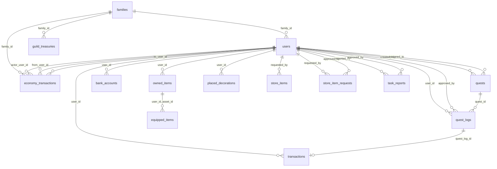

# DB構造

このドキュメントは、テーブルの役割・関係・「1つの操作で何が一緒に変わるか」を1か所から読めるようにするための入口です。エコノミー系（#159〜#166）に着手する人や、Issue #187 を引き受けた人はまずここを読んでください。

用語の意味（例: HMC、ギルド金庫、Wallet など）は [docs/domain-glossary.md](../domain-glossary.md) にあるので、ここでは重複させません。

このドキュメントが記述している「現在の構造」は、下記のテーブル一覧・RPC定義を実際にSupabase上で確認した時点のものです。構造そのものの変更はこのドキュメントの対象外です。変更する場合は `supabase/migrations/` にマイグレーションを追加してください（[AGENTS.md](../../AGENTS.md) の「DBの構造変更」を参照）。

## 1. テーブル一覧（役割ごと）

### 家族・利用者・口座
| テーブル | 役割 |
|---|---|
| `families` | 家族（グループ）そのもの |
| `users` | 家族に属する利用者（親・子）。`balance` が子どもの Wallet |
| `bank_accounts` | 利用者ごとの銀行口座（預金・ローン） |

### エコノミー（ギルド金庫）
| テーブル | 役割 |
|---|---|
| `guild_treasuries` | 家族単位のギルド金庫。残高・供給量・最低準備金率 |
| `economy_transactions` | ギルド金庫を起点とする資金移動の台帳（#165 で作成された共通基盤） |

### クエスト・タスク
| テーブル | 役割 |
|---|---|
| `quests` | クエストの定義（誰が作り、誰に割り当てられているか） |
| `quest_logs` | 1人の1回のクエスト実施・承認の記録 |
| `task_reports` | タスク報告（クエストとは別枠） |

### ストア
| テーブル | 役割 |
|---|---|
| `store_items` | ストアに並ぶ商品 |
| `store_item_requests` | 「こういう商品を追加してほしい」という申請 |

### アイテム・見た目
| テーブル | 役割 |
|---|---|
| `owned_items` | 利用者が所持しているアイテム |
| `equipped_items` | 利用者が今装備しているアイテム（`owned_items` の一部） |
| `placed_decorations` | 部屋などに配置した装飾の座標 |

### 台帳（取引履歴）
| テーブル | 役割 |
|---|---|
| `transactions` | 利用者個人の収支履歴（預入・引き出し・クエスト報酬など） |
| `economy_transactions` | 家族／ギルド金庫単位の資金移動履歴（上記参照） |

**`transactions` と `economy_transactions` は別物です。** 個人の Wallet・銀行の動きは `transactions` に、ギルド金庫を起点とする動き（現状は金庫の初期化のみ）は `economy_transactions` に記録されます。#159 の「すべての資金移動を取引履歴へ記録する」を実装する際は、どちらに書くかをまず決める必要があります。

## 2. テーブル同士がどのIDでつながるか

DBの外部キー（FK）で保証されている関係のみを図にします。

`equipped_items` は `user_id` と `asset_id` の組み合わせで `owned_items` を参照する複合外部キーです。

### DBのFKでは保証されていない関係（アプリ側で繋いでいるだけ）
現在の構造から確認できないものは、必須本数や必ず対になるかどうかを推測で描いていません。以下はアプリのロジック上つながっているはずですが、DB制約としては存在しません。

- `store_item_requests`（申請）→ `store_items`（商品化）：承認されたら商品になる、という関係を保証するFKはない
- `economy_transactions.related_type` / `related_id`：型（クエスト・ローンなど）ごとに異なるテーブルを指すためFKを持たない（ポリモーフィックな参照）
- `transactions.type` の値ごとの関連先（例: `bank_deposit` と `bank_accounts` の関係）：`quest_log_id` 以外はFKなし

## 3. 各テーブルの1行が何を表すか

| テーブル | 1行 = |
|---|---|
| `families` | 1つの家族グループ |
| `users` | 1人の利用者（親 or 子） |
| `bank_accounts` | 1人の利用者の銀行口座（1対1） |
| `guild_treasuries` | 1つの家族のギルド金庫（1対1） |
| `economy_transactions` | ギルド金庫を起点とする1回の資金移動 |
| `quests` | 1つのクエスト定義 |
| `quest_logs` | 1人が1つのクエストを1回実施した記録 |
| `task_reports` | 1件のタスク報告 |
| `store_items` | ストアに並ぶ1つの商品 |
| `store_item_requests` | 1件の商品追加申請 |
| `owned_items` | 1人が1つのアイテムを所持している事実 |
| `equipped_items` | 1人の1部位（`slot`）に今装備されているアイテム |
| `placed_decorations` | 配置された1つの装飾オブジェクト |
| `transactions` | 利用者個人の収支1件 |

## 4. 操作したときに、どの表が一緒に変わるか

現在存在するRPCはすべて `SECURITY DEFINER` で、1つのトランザクション内で完結します。

### `approve_quest_log(quest_log_id, approver_id)` — クエスト承認
1. `quest_logs` を `pending` の行に絞って行ロック（`for update`）
2. `quest_logs.status` を `approved` に更新
3. `quests.status` を `completed` に更新
4. `transactions` に報酬を1行挿入（`quest_log_id` に一意制約があり、二重承認では挿入されない）
5. 実際に3で挿入された場合のみ `users.balance` に報酬額を加算

「クエスト承認」は `quest_logs` / `quests` / `transactions` / `users` の4テーブルが1トランザクションで確定します。

### `bank_deposit(user_id, amount)` — 預入
1. `users` を行ロック → 所持金（`balance`）を確認
2. `bank_accounts` を行ロック（ロック順序は `users` → `bank_accounts` で固定）
3. `users.balance` を減算、`bank_accounts.deposit_balance` を加算
4. `transactions` に1行挿入

### `bank_withdraw(user_id, amount)` — 引き出し
`bank_deposit` と同じロック順序（`users` → `bank_accounts`）で、`users.balance` を加算・`bank_accounts.deposit_balance` を減算し、`transactions` に1行挿入します。

**ロック順序が `users` → `bank_accounts` に統一されている点は重要です。** デッドロックを避けるための意図的な設計なので、新しいRPCを書くときもこの順序に合わせる必要があります。

### `create_family_with_treasury(family_name, initial_supply, idempotency_key)` — 家族とギルド金庫の作成
1. `users` を行ロックし、`role = 'parent'` かつ未所属であることを確認
2. `idempotency_key` で `economy_transactions` を検索し、同じキーの実行がすでにあれば新規作成せず既存の `family_id` を返す（同時多重送信対策）
3. `bank_accounts` を行ロックし、Wallet残高・預金残高が安全な整数範囲か検証
4. `families` に1行挿入
5. `users.family_id` を更新
6. `guild_treasuries` に1行挿入（`initial_supply` と、既存のWallet・預金残高を合算した `total_supply`）
7. `economy_transactions` に `type = 'treasury_initialization'` で1行挿入

`families` / `users` / `bank_accounts` / `guild_treasuries` / `economy_transactions` の5テーブルが1トランザクションで確定します。

### 気になる点（要確認）
- `approve_quest_log` / `bank_deposit` / `bank_withdraw` は `SET search_path TO 'public'` で、テーブル名をスキーマ修飾せずに書いています。一方 `create_family_with_treasury` は `SET search_path TO ''` にした上で `public.users` のようにすべて修飾しています。後者の方が `search_path` 経由の意図しないテーブル参照に強い、より安全な書き方です。RLSを有効化するタイミング（#24, #208）で、この不統一を揃えるかどうかは検討の余地があります。
- `create_family_with_treasury` は `private.safe_integer_max()` という関数を呼んでいますが、定義は未確認です（安全な整数上限を返す関数と推測されますが、中身は見ていません）。

## 5. 現在の構造を確認する方法

- `supabase/migrations/` 配下の全マイグレーションを順に適用すると、現在の構造が再現されます（Issue #182 / PR #183 で解決済み）。
- 個別のテーブル・RPCの現在の定義をSupabase上で直接確認したい場合は、Issue #187 に記載の確認クエリを使ってください。